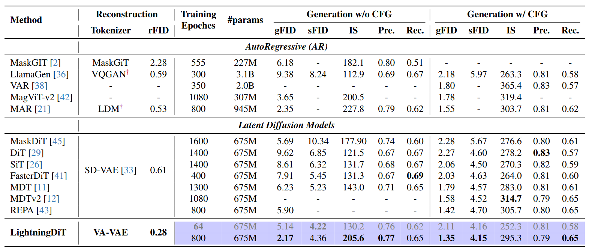

<div align="center">

<h2>⚡Reconstruction <i>vs.</i> Generation:

Taming Optimization Dilemma in Latent Diffusion Models</h2>

**_FID=1.35 on ImageNet-256 & 21.8x faster training than DiT!_**

[Jingfeng Yao](https://github.com/JingfengYao)¹, [Bin Yang](https://www.cs.toronto.edu/~byang/)², [Xinggang Wang](https://xwcv.github.io/index.htm)¹*

¹ ​Huazhong University of Science and Technology (HUST)  
² ​Independent Researcher

*Corresponding author: xgwang@hust.edu.cn

[](https://paperswithcode.com/sota/image-generation-on-imagenet-256x256?p=reconstruction-vs-generation-taming-1)
<!-- []()
[](https://arxiv.org/abs/2410.10356) -->
[](LICENSE)
[](https://github.com/hustvl)
[](https://arxiv.org/abs/2501.01423)
[](https://arxiv.org/abs/2410.10356)


</div>
<div align="center">

</div>

## ✨ Highlights

- Latent diffusion system with 0.28 rFID and **1.35 FID on ImageNet-256** generation!

- **More than 21.8× faster** convergence with **VA-VAE** and **LightningDiT** than original DiT!

- **Surpass DiT with FID=2.11 with only 8 GPUs in about 10 hours**. Let's make diffusion transformers research more affordable!

## 📰 News

- **[2025.04.04]** VA-VAE has been selected as **Oral Presentation!** 

- **[2025.02.27]** **VA-VAE has been accepted by CVPR 2025!** 🎉🎉🎉

- **[2025.02.25]** We have released [training codes of VA-VAE](vavae)!

- **[2025.01.16]** More experimental tokenizer variants have been released! You could check them [here](https://huggingface.co/hustvl/va-vae-imagenet256-experimental-variants/tree/main).

- **[2025.01.02]** We have released the pre-trained weights.

- **[2025.01.01]** We have released the code and paper for VA-VAE and LightningDiT! The weights and pre-extracted latents will be released soon.

## 📄 Introduction

Latent diffusion models (LDMs) with Transformer architectures excel at generating high-fidelity images. However, recent studies reveal an **optimization dilemma** in this two-stage design: while increasing the per-token feature dimension in visual tokenizers improves reconstruction quality, it requires substantially larger diffusion models and more training iterations to achieve comparable generation performance.
Consequently, existing systems often settle for sub-optimal solutions, either producing visual artifacts due to information loss within tokenizers or failing to converge fully due to expensive computation costs.

We argue that this dilemma stems from the inherent difficulty in learning unconstrained high-dimensional latent spaces. To address this, we propose aligning the latent space with pre-trained vision foundation models when training the visual tokenizers. Our proposed VA-VAE (Vision foundation model Aligned Variational AutoEncoder) significantly expands the reconstruction-generation frontier of latent diffusion models, enabling faster convergence of Diffusion Transformers (DiT) in high-dimensional latent spaces.
To exploit the full potential of VA-VAE, we build an enhanced DiT baseline with improved training strategies and architecture designs, termed LightningDiT.
The integrated system demonstrates remarkable training efficiency by reaching FID=2.11 in just 64 epochs -- an over 21× convergence speedup over the original DiT implementations, while achieving state-of-the-art performance on ImageNet-256 image generation with FID=1.35.

## 📝 Results

- State-of-the-art Performance on ImageNet 256x256 with FID=1.35.
- Surpass DiT within only 64 epochs training, achieving 21.8x speedup.

<div align="center">

</div>

## 🎯 How to Use

### Installation

```
conda create -n lightningdit python=3.10.12
conda activate lightningdit
pip install -r requirements.txt
```


### Inference with Pre-trained Models

- Download weights and data infos:

    - Download pre-trained models
        | Tokenizer | Generation Model | FID | FID cfg |
        |:---------:|:----------------|:----:|:---:|
        | [VA-VAE](https://huggingface.co/hustvl/vavae-imagenet256-f16d32-dinov2/blob/main/vavae-imagenet256-f16d32-dinov2.pt) | [LightningDiT-XL-800ep](https://huggingface.co/hustvl/lightningdit-xl-imagenet256-800ep/blob/main/lightningdit-xl-imagenet256-800ep.pt) | 2.17 | 1.35 |
        |           | [LightningDiT-XL-64ep](https://huggingface.co/hustvl/lightningdit-xl-imagenet256-64ep/blob/main/lightningdit-xl-imagenet256-64ep.pt) | 5.14 | 2.11 |

    - Download [latent statistics](https://huggingface.co/hustvl/vavae-imagenet256-f16d32-dinov2/blob/main/latents_stats.pt). This file contains the channel-wise mean and standard deviation statistics.

    - Modify config file in ``configs/reproductions`` as required. 

- Fast sample demo images:

    Run:
    ```
    bash bash run_fast_inference.sh ${config_path}
    ```
    Images will be saved into ``demo_images/demo_samples.png``, e.g. the following one:
    <div align="center">
    
    </div>

- Sample for FID-50k evaluation:
    
    Run:
    ```
    bash run_inference.sh ${config_path}
    ```
    NOTE: The FID result reported by the script serves as a reference value. The final FID-50k reported in paper is evaluated with ADM:

    ```
    git clone https://github.com/openai/guided-diffusion.git
    
    # save your npz file with tools/save_npz.py
    bash run_fid_eval.sh /path/to/your.npz
    ```

## 🎮 Train Your Own Models

 
- **We provide a 👆[detailed tutorial](docs/tutorial.md) for training your own models of 2.1 FID score within only 64 epochs. It takes only about 10 hours with 8 x H800 GPUs.** 


## ❤️ Acknowledgements

This repo is mainly built on [DiT](https://github.com/facebookresearch/DiT), [FastDiT](https://github.com/chuanyangjin/fast-DiT) and [SiT](https://github.com/willisma/SiT). Our VAVAE codes are mainly built with [LDM](https://github.com/CompVis/latent-diffusion) and [MAR](https://github.com/LTH14/mar). Thanks for all these great works.

## 📝 Citation

If you find our work useful, please cite our related paper:

```
# CVPR 2025
@inproceedings{yao2025vavae,
  title={Reconstruction vs. generation: Taming optimization dilemma in latent diffusion models},
  author={Yao, Jingfeng and Yang, Bin and Wang, Xinggang},
  booktitle={Proceedings of the IEEE/CVF Conference on Computer Vision and Pattern Recognition},
  year={2025}
}

# NeurIPS 2024
@article{yao2024fasterdit,
  title={Fasterdit: Towards faster diffusion transformers training without architecture modification},
  author={Yao, Jingfeng and Wang, Cheng and Liu, Wenyu and Wang, Xinggang},
  journal={Advances in Neural Information Processing Systems},
  volume={37},
  pages={56166--56189},
  year={2024}
}
```
